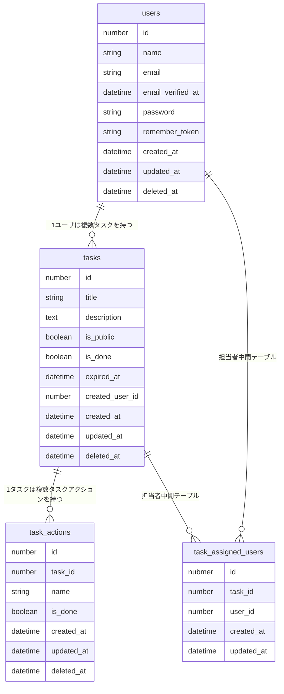

# 📦 テーブル一覧

## ユーザ　`users`

| カラム名          | 型           | 属性               |
| ----------------- | ------------ | ------------------ |
| id                | BIGINT       | PK, AUTO_INCREMENT |
| name              | VARCHAR      | NOT NULL           |
| email             | VARCHAR      | UNIQUE, NOT NULL   |
| email_verified_at | TIMESTAMP    | NULLABLE           |
| password          | VARCHAR      | NOT NULL           |
| remember_token    | VARCHAR(100) | NULLABLE           |
| created_at        | TIMESTAMP    |                    |
| updated_at        | TIMESTAMP    |                    |
| deleted_at        | TIMESTAMP    | Soft delete対応    |

## タスク `tasks`

| カラム名        | 型        | 属性                              |
| --------------- | --------- | --------------------------------- |
| id              | BIGINT    | PK, AUTO_INCREMENT                |
| title           | VARCHAR   | NOT NULL                          |
| description     | TEXT      | NULLABLE                          |
| is_public       | BOOLEAN   | NOT NULL                          |
| is_done         | BOOLEAN   | NOT NULL                          |
| expired_at      | DATETIME  | NULLABLE                          |
| created_user_id | BIGINT    | FK → users(id), ON DELETE CASCADE |
| created_at      | TIMESTAMP |                                   |
| updated_at      | TIMESTAMP |                                   |
| deleted_at      | TIMESTAMP | Soft delete対応                   |

## タスクの担当者中間テーブル `task_assigned_users`

| カラム名                                      | 型        | 属性                              |
| --------------------------------------------- | --------- | --------------------------------- |
| id                                            | BIGINT    | PK, AUTO_INCREMENT                |
| task_id                                       | BIGINT    | FK → tasks(id), ON DELETE CASCADE |
| user_id                                       | BIGINT    | FK → users(id), ON DELETE CASCADE |
| created_at                                    | TIMESTAMP |                                   |
| updated_at                                    | TIMESTAMP |                                   |
| UNIQUE(task_id, user_id) — 重複割り当てを防止 |

## タスクアクション `task_actions`

| カラム名   | 型        | 属性                              |
| ---------- | --------- | --------------------------------- |
| id         | BIGINT    | PK, AUTO_INCREMENT                |
| task_id    | BIGINT    | FK → tasks(id), ON DELETE CASCADE |
| name       | VARCHAR   | NOT NULL                          |
| is_done    | BOOLEAN   | NOT NULL                          |
| created_at | TIMESTAMP |                                   |
| updated_at | TIMESTAMP |                                   |
| deleted_at | TIMESTAMP | Soft delete対応                   |

## ER図

